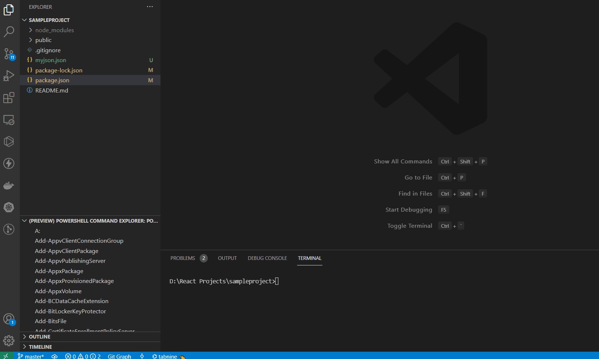
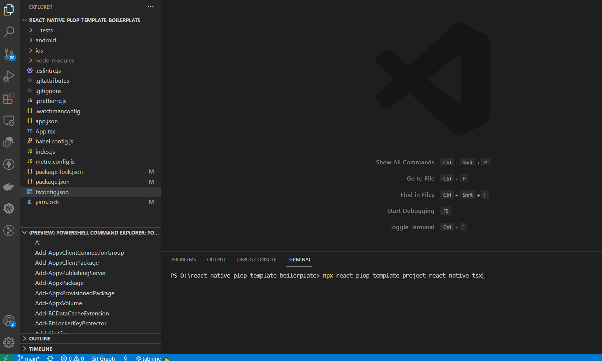

<p align="center">
  <a href="https://reactnativeelements.com/">
    
  </a>
</p>

<p align="center" style="font-size:1.0rem;">
    Wrapper over plop to help react and react native developer out their to generate components, pages and reducers with it's necessary files and folder and keep the naming convention of the files consistency across the project.
</p>

## Get Started 


[](https://www.npmjs.com/package/react-plop-template)
&nbsp;
[](https://www.npmjs.com/package/react-plop-template)
## Problem Statement
As you all know react is a UI library and not come's with any structure like angular provide it's own structure to follow.
I know it's good to have own structure and not bound to any structure that framework provide. But I think when we are working in a team then we have to set a structure to follow and care about the naming convention to follow. So, every developer can follow the same.
That's where react plop template package is coming, Which is a wrapper over plop to generate react / react-native components, pages and reducers with it's necessary files and folders. You don't need to create a components, reducers and it's necessary files, the react-plop-template will do it for you.  
## What is React Plop Template?
React Plop Template is "micro-generator package." 
It is a small tool that gives you a simple way to generate your react / react-native components, pages and reducers in a consistent way. 
## Installation
### 1. Add react plop template to your project
```sh
$ npm install --save-dev react-plop-template
```
## CLI Usage
Once react-plop-template is installed, and you have created a generator, you are ready to run plop from the terminal. Running `npm run generate` with no parameters will present you with a list of generators to pick from. You can also run `npm run generate [generatorName]`

```javascript
// package.json
{
    ...,
    "scripts": {
        "generate": "react-plop-template"
    },
    ...
}
```
### Add project and extension to react plop template
```sh
$ npm run generate project
```
```sh
$ npm run generate project react tsx
```
```sh
$ npm run generate project react-native jsx
```
### Package includes: - [x]
[Component Generation] - [x]
[Page Generation] - [x]
[Reducer Generation] - [x]
## Generate Component
```sh
$ npm run generate component [component name]
```

## Generate page for React
```sh
$ npm run generate page [page name]
```
## Generate screen for React Native
```sh
$ npm run generate screen [screen name]
```
## Generate Reducer
```sh
$ npm run generate reducer [reducer name]
```
## Demo for React Native

> This documentation is a work in progress. If you have great ideas, I'd love to hear them.
